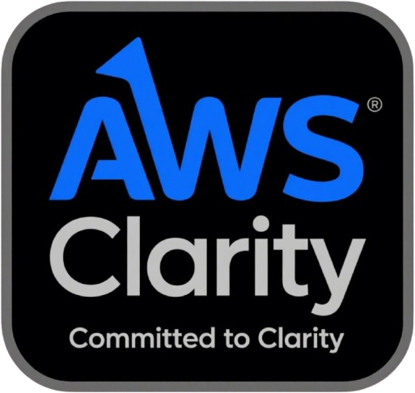

# Pitch Deck: AWS Clarity

---

### **Slide 1: Judul**

**AWS Clarity**

*Misi Kontrol Anda untuk AWS*

Sebuah kolaborasi dengan **PT Digi Media Komunika**.

---

### **Slide 2: Masalah**

**Manajemen Cloud AWS itu Kompleks & Terfragmentasi**

- Tim menghabiskan waktu berharga untuk beralih di antara beberapa konsol AWS (EC2, S3, RDS, CloudWatch, dll.).
- Sulit untuk mendapatkan gambaran umum yang jelas tentang kesehatan infrastruktur dan biaya secara bersamaan.
- Menganalisis log untuk pemecahan masalah sering kali memakan waktu dan memerlukan keahlian khusus.
- Pengeluaran cloud dapat dengan mudah membengkak tanpa pengawasan proaktif.

---

### **Slide 3: Solusi**

**Memperkenalkan AWS Clarity**

Satu dasbor terpusat untuk memantau, mengelola, dan mengoptimalkan seluruh lingkungan AWS Anda.

AWS Clarity mengubah data yang kompleks menjadi wawasan yang dapat ditindaklanjuti, memungkinkan Anda untuk fokus pada inovasi, bukan pada manajemen.

---

### **Slide 4: Fitur Utama**

- **Dasbor Terpadu**: Status layanan, metrik kinerja, dan waktu aktif dalam satu pandangan.
- **Pelacakan Biaya & Anggaran**: Visualisasi biaya harian/bulanan dengan peringatan perkiraan cerdas.
- **Analisis Log AI**: Dapatkan ringkasan log dalam bahasa alami secara instan.
- **Status Pipeline CI/CD**: Pantau pipeline deployment Anda secara real-time.
- **Manajemen Akses**: Kontrol akses berbasis peran yang aman untuk seluruh tim.

---

### **Slide 5: Proposisi Nilai**

- **Tingkatkan Efisiensi Operasional**: Kurangi waktu yang dihabiskan untuk beralih antar konsol.
- **Optimalkan Biaya Cloud**: Buat keputusan berbasis data untuk mengendalikan pengeluaran.
- **Percepat Pemecahan Masalah**: Identifikasi masalah lebih cepat dengan ringkasan log AI.
- **Tingkatkan Keandalan**: Pantau waktu aktif layanan secara proaktif dan dapatkan peringatan.

---

### **Slide 6: Target Audiens**

- **Manajer Cloud & DevOps**: Mereka yang bertanggung jawab atas kesehatan dan biaya infrastruktur.
- **Developer**: Mereka yang membutuhkan visibilitas ke dalam layanan dan pipeline yang mereka gunakan.
- **Manajer Keuangan/Operasional**: Mereka yang melacak anggaran dan pengeluaran cloud.
- **Klien PT Digi Media Komunika**: Sebagai layanan bernilai tambah untuk menyederhanakan manajemen cloud.

---

### **Slide 7: Ajakan Bertindak (Call to Action)**

**Dapatkan Kejelasan. Dapatkan Kontrol.**

Kunjungi situs web kami untuk memulai uji coba gratis dan rasakan sendiri kekuatan AWS Clarity.

**[Mulai Sekarang](#)**

---
